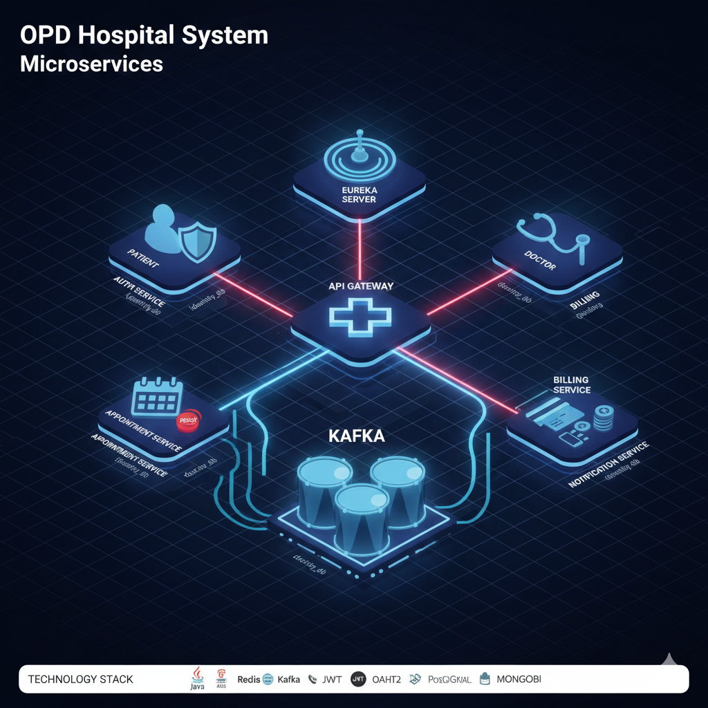

# 🏥 OPD Hospital System Microservice



*A scalable microservices-based outpatient (OPD) hospital management system*

---

## 📚 Documentation

| Document | Description |
|----------|-------------|
| **[docs/ARCHITECTURE.md](docs/ARCHITECTURE.md)** | Full architecture reference: endpoint tables, Kafka schemas, Redis locking, DB schemas, config keys, architecture diagrams, and runbook |

> The architecture document is derived directly from the source code and supersedes the endpoint examples in this README where there are differences.

---

## 📌 Overview

The **OPD Hospital System** manages hospital outpatient operations using a modern **microservices architecture**. It covers the complete OPD flow including **patient authentication, doctor management, appointment booking, billing, and notifications**.

The system is built with **Java & Spring Boot**, uses **Eureka for service discovery**, **API Gateway for routing and security**, **Kafka for event-driven communication**, and **multiple databases** optimized per service.

---

## ✨ Key Features

- JWT-secured patient registration and login
- Doctor profile management and scheduling
- Appointment booking with **slot locking** to avoid double booking
- Billing and payment integration
- Event-driven Email / SMS notifications

---

## 🏗️ Architecture

The system follows a **microservices architecture**:

### Core Components

- **API Gateway**
  - Routes all client requests
  - Validates JWT tokens
  - Acts as a single entry point

- **Eureka Server**
  - Service registry and discovery

- **Microservices**
  - Auth Service
  - Doctor Service
  - Appointment Service
  - Billing Service
  - Notification Service

- **Messaging**
  - Kafka for asynchronous events (appointment booked, payment completed, etc.)

- **Databases**
  - PostgreSQL (multiple schemas)
  - MongoDB (billing data)

- **Caching**
  - Redis for appointment slot locking

- **Security**
  - Spring Security with JWT & OAuth2

### Communication Pattern

- **Synchronous**: REST (via API Gateway)
- **Asynchronous**: Kafka events

---

## 🧩 Microservices Details

### 🔐 Auth Service

**Responsibilities**
- Patient registration and login
- JWT token generation and validation
- OAuth2 support (extensible)

**Connections**
- PostgreSQL (`identity_db`)
- Eureka registered

---

### 🩺 Doctor Service

**Responsibilities**
- Doctor profile management
- Doctor schedules and availability

**Connections**
- PostgreSQL (`doctor_db`)
- Called synchronously by Appointment Service

---

### 📅 Appointment Service

**Responsibilities**
- Appointment booking and cancellation
- Serial number generation
- Slot locking using Redis

**Connections**
- PostgreSQL (`appointment_db`)
- Redis (slot locks)
- Kafka producer
- Sync communication with Doctor & Billing services

---

### 💳 Billing Service

**Responsibilities**
- Invoice generation
- Payment processing
- Payment status tracking

**Connections**
- MongoDB (`billing_db`)
- Kafka consumer

---

### 📣 Notification Service

**Responsibilities**
- Email and SMS notifications

**Connections**
- Kafka consumer
- JavaMail / Twilio (or mock integrations)

---

## 🌐 API Gateway & Eureka

- **API Gateway**
  - Centralized routing
  - Authentication & authorization

- **Eureka Server**
  - Registers and discovers all services

---

## 🧰 Technology Stack

| Category | Technologies |
|------|-------------|
| Backend | Java 21, Spring Boot 4.x, Spring Cloud |
| Databases | PostgreSQL, MongoDB |
| Messaging / Caching | Kafka, Zookeeper, Redis |
| Security | JWT, OAuth2, Spring Security |
| Tooling | Docker Compose, Maven, Lombok, JPA |

---

## 🚀 Installation & Setup

### Prerequisites

- Java 21+
- Docker & Docker Compose
- Gradle (wrapper included in each service – no install needed)

### Setup Steps

```bash
# Clone repository
git clone https://github.com/KhairulBasharbd/opd-hospital-system-microservice.git
cd opd-hospital-system-microservice

# 1. Start infrastructure (PostgreSQL, MongoDB, Redis, Kafka)
docker-compose up -d

# 2. Set required environment variable (must be the same for auth service AND api gateway)
export JWT_SECRET=my-local-dev-secret-at-least-32chars

# 3. Start services in order (each in its own terminal):
#    Eureka → Auth → Doctor → Billing → Appointment → Notification → Gateway
cd opd-eureka-server     && ./gradlew bootRun &
cd opd-auth-service      && ./gradlew bootRun &
cd opd-doctor-service    && ./gradlew bootRun &
cd opd-billing-service   && ./gradlew bootRun &
cd opd-appointment-service && ./gradlew bootRun &
cd opd-notification-service && ./gradlew bootRun &
cd opd-api-gateway       && ./gradlew bootRun &
```

> See [docs/ARCHITECTURE.md – Runbook](docs/ARCHITECTURE.md#10-runbook) for the complete step-by-step guide, environment variables, troubleshooting, and cURL examples.

---

## ▶️ Usage

- Access system via **API Gateway**: `http://localhost:8080`
- **Swagger UI** (all services): `http://localhost:8080/swagger-ui.html`
- **Eureka Dashboard**: `http://localhost:8761`
- **Kafka UI (Redpanda Console)**: `http://localhost:8089`
- Secure endpoints require `Authorization: Bearer <JWT>` token

---

## 📡 API Quick Reference

> All requests go through API Gateway (`http://localhost:8080`).  
> For complete endpoint tables with request/response DTOs, see **[docs/ARCHITECTURE.md §4](docs/ARCHITECTURE.md#4-api-endpoint-reference)**.

### 🔐 Authentication

| Method | Gateway Endpoint | Auth | Description |
|--------|-----------------|------|-------------|
| `POST` | `/auth/register/patient` | No | Register a patient |
| `POST` | `/auth/register/users` | No | Create ADMIN or DOCTOR user |
| `POST` | `/auth/login` | No | Login – returns JWT |
| `GET` | `/auth/profile` | Yes | View patient profile |
| `PUT` | `/auth/profile` | Yes | Update patient profile |

### 🩺 Doctor Management

| Method | Gateway Endpoint | Auth | Description |
|--------|-----------------|------|-------------|
| `POST` | `/doctors/api/doctors` | Yes | Create doctor |
| `GET` | `/doctors/api/doctors` | Yes | List all doctors |
| `GET` | `/doctors/api/doctors/available?date=dd/MM/yyyy&specialization=CARDIOLOGY` | Yes | Available doctors for date |
| `GET` | `/doctors/api/doctors/{id}` | Yes | Doctor details |
| `PUT` | `/doctors/api/doctors/{id}` | Yes | Update doctor |
| `DELETE` | `/doctors/api/doctors/{id}` | Yes | Delete doctor |
| `POST` | `/doctors/api/doctors/{doctorId}/schedules` | Yes | Add schedule |
| `GET` | `/doctors/api/doctors/{doctorId}/schedules` | Yes | Doctor's schedules |
| `PUT` | `/doctors/api/doctors/schedules/{scheduleId}` | Yes | Update schedule |
| `DELETE` | `/doctors/api/doctors/schedules/{scheduleId}` | Yes | Delete schedule |

### 📅 Appointments

| Method | Gateway Endpoint | Auth | Description |
|--------|-----------------|------|-------------|
| `POST` | `/appointments/appointments/create` | Yes | Book appointment |

### 💳 Billing

| Method | Gateway Endpoint | Auth | Description |
|--------|-----------------|------|-------------|
| `POST` | `/billing/api/billing/pay/{invoiceId}` | Yes | Pay invoice |
| `GET` | `/billing/api/billing/patient/{patientId}` | Yes | Patient's invoice history |

### 📣 Notifications

Fully **event-driven** via Kafka – no direct REST endpoints. Triggered automatically on appointment booking, payment, and confirmation.

---

## 🧪 Quick cURL Examples

### Register a patient

```bash
curl -X POST http://localhost:8080/auth/register/patient \
  -H "Content-Type: application/json" \
  -d '{"fullName":"Rahim Khan","email":"rahim@example.com","password":"securepass456"}'
```

### Login

```bash
curl -X POST http://localhost:8080/auth/login \
  -H "Content-Type: application/json" \
  -d '{"email":"rahim@example.com","password":"securepass456"}'
```

### Book Appointment

```bash
curl -X POST http://localhost:8080/appointments/appointments/create \
  -H "Authorization: Bearer <JWT>" \
  -H "Content-Type: application/json" \
  -d '{"doctorId":"<UUID>","scheduleId":"<UUID>","date":"2025-06-20"}'
```

---

## 📝 Notes

- Swagger UI available at `http://localhost:8080/swagger-ui.html`
- Standard error response format:

```json
{ "status": 400, "message": "Error description" }
```

---

## 🤝 Contributing

1. Fork the repository
2. Create a feature branch
3. Commit changes with clear messages
4. Submit a Pull Request

Follow clean code practices and include tests.

---

## 📄 License

MIT License – see the `LICENSE` file for details.

---

## 👨‍💻 Author

**Khairul Bashar**  
Backend Engineer | Microservices & Distributed Systems Enthusiast

GitHub: https://github.com/KhairulBasharbd

---

⭐ *Built as a real-world, production-thinking OPD hospital microservice system.*

