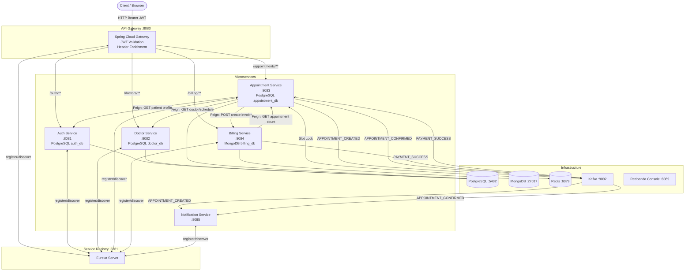

# 🏥 OPD Hospital System – Architecture & Developer Reference

> **Derived directly from the source code** (branch `master`).  
> Where the existing README makes claims that are not yet implemented in code, this document flags them with ⚠️.

---

## Table of Contents

1. [System Overview](#1-system-overview)
2. [Architecture Diagrams](#2-architecture-diagrams)
3. [Service Inventory & Ports](#3-service-inventory--ports)
4. [API Endpoint Reference](#4-api-endpoint-reference)
   - [API Gateway Routes](#41-api-gateway-routes)
   - [Auth Service](#42-auth-service-port-8081)
   - [Doctor Service](#43-doctor-service-port-8082)
   - [Appointment Service](#44-appointment-service-port-8083)
   - [Billing Service](#45-billing-service-port-8084)
   - [Notification Service](#46-notification-service-port-8085)
5. [JWT & Security](#5-jwt--security)
6. [Kafka Event Schemas](#6-kafka-event-schemas)
7. [Redis Slot Locking](#7-redis-slot-locking)
8. [Database Schemas](#8-database-schemas)
   - [PostgreSQL – Auth DB](#81-postgresql--auth_db)
   - [PostgreSQL – Doctor DB](#82-postgresql--doctor_db)
   - [PostgreSQL – Appointment DB](#83-postgresql--appointment_db)
   - [MongoDB – Billing DB](#84-mongodb--billing_db)
9. [Configuration Reference](#9-configuration-reference)
10. [Runbook](#10-runbook)

---

## 1. System Overview

The OPD Hospital System manages outpatient operations using a **microservices** architecture. The patient journey is:

```
Register → Login → Browse Doctors → Book Appointment → Pay Invoice → Receive Notification
```

**Communication patterns:**

| Pattern | Technology | Used For |
|---------|-----------|----------|
| Synchronous REST | Spring Cloud Gateway + OpenFeign | Client → Gateway → Service; Service → Service |
| Asynchronous events | Apache Kafka | Appointment events, payment events, notifications |
| Distributed locking | Redis | Prevent double-booking of appointment slots |
| Service discovery | Netflix Eureka | All services register; Feign resolves service names |

---

## 2. Architecture Diagrams

### 2.1 High-Level Mermaid Diagram



### 2.2 Request Flow – Book Appointment (ASCII)

```
Client
  │  POST /appointments/appointments/create
  │  Authorization: Bearer <JWT>
  ▼
API Gateway (:8080)
  ├─ Validates JWT (HS256)
  ├─ Injects headers: X-User-ID, X-User-Email, X-User-Role
  └─ Routes → Appointment Service (:8083)
               │
               ├─ Feign → Auth Service (:8081)
               │    GET /internal/profile/{patientId}
               │    ◄ PatientProfileDetails
               │
               ├─ Feign → Doctor Service (:8082)
               │    GET /api/doctors/{doctorId}
               │    GET /api/doctors/schedules/{scheduleId}
               │    GET /internal/doctors/{doctorId}/schedules/{scheduleId}/{lastSerialNo}/availability
               │    ◄ DoctorResponse, DoctorScheduleResponse, Boolean
               │
               ├─ Redis SETNX lock:appointment:{doctorId}:{scheduleId}:{date} TTL=8s
               │
               ├─ Feign → Billing Service (:8084)
               │    POST /api/billing/invoice
               │    ◄ BillingServiceResponse { invoiceId, paymentLink }
               │
               ├─ Persists AppointmentEntity (status=PENDING)
               │
               └─ Kafka → APPOINTMENT_CREATED
                          └─ Notification Service consumes → sends Email + SMS
```

### 2.3 Payment Flow (ASCII)

```
Client
  │  POST /billing/api/billing/pay/{invoiceId}
  ▼
API Gateway → Billing Service (:8084)
  ├─ Updates InvoiceDocument (status=PAID, payment embedded)
  └─ Kafka → PAYMENT_SUCCESS { appointmentId, invoiceId, amountPaid, paidAt }
                  │
                  ├─ Appointment Service consumes (ack-mode=manual)
                  │    confirmAppointment(appointmentId)
                  │    └─ Assigns serialNo, status=CONFIRMED
                  │    └─ Kafka → APPOINTMENT_CONFIRMED
                  │                  └─ Notification Service → Email + SMS
                  │
```

---

## 3. Service Inventory & Ports

| Service | Spring App Name | Port | Database | Infra Dependencies |
|---------|----------------|------|----------|--------------------|
| `opd-eureka-server` | `opd-eureka-server` | **8761** | — | — |
| `opd-api-gateway` | `opd-api-gateway` | **8080** | — | Eureka |
| `opd-auth-service` | `opd-auth-service` | **8081** | PostgreSQL `auth_db` | Eureka |
| `opd-doctor-service` | `opd-doctor-service` | **8082** | PostgreSQL `doctor_db` | Eureka |
| `opd-appointment-service` | `opd-appointment-service` | **8083** | PostgreSQL `appointment_db` | Eureka, Redis, Kafka |
| `opd-billing-service` | `opd-billing-service` | **8084** | MongoDB `billing_db` | Eureka, Kafka |
| `opd-notification-service` | `opd-notification-service` | **8085** | — | Eureka, Kafka |

**Infrastructure ports (docker-compose.yml):**

| Component | Container | Host Port | Notes |
|-----------|-----------|-----------|-------|
| PostgreSQL | `opd-postgres` | 5432 | User: `admin`, Pass: `admin` |
| MongoDB | `opd-mongo` | 27017 | No auth in default compose |
| Redis | `opd-redis` | 6379 | No auth in default compose |
| Kafka | `opd-kafka` | 9092 | KRaft mode (no Zookeeper) |
| Redpanda Console | `opd-redpanda-console` | 8089 | Kafka UI at http://localhost:8089 |
| pgAdmin | `opd-pgadmin` | 5050 | Email: `admin@admin.com`, Pass: `admin123` |

---

## 4. API Endpoint Reference

> **All client requests go through the API Gateway at `http://localhost:8080`.**  
> The gateway uses `StripPrefix=1`, so the first path segment is the routing prefix:
> - `/auth/…` → auth-service (the `/auth` segment is stripped)
> - `/doctors/…` → doctor-service (the `/doctors` segment is stripped)
> - `/appointments/…` → appointment-service (the `/appointments` segment is stripped)
> - `/billing/…` → billing-service (the `/billing` segment is stripped)

### 4.1 API Gateway Routes

| Gateway Predicate | Target Service | Strip Prefix | Auth Required |
|-------------------|---------------|--------------|---------------|
| `/auth/**` | `lb://opd-auth-service` | 1 | No (all `/auth/**` is `permitAll`) |
| `/doctors/**` | `lb://opd-doctor-service` | 1 | Yes (JWT) |
| `/appointments/**` | `lb://opd-appointment-service` | 1 | Yes (JWT) |
| `/billing/**` | `lb://opd-billing-service` | 1 | Yes (JWT) |

**Public paths (no JWT required):**

```
/auth/**
/v3/api-docs/**
/swagger-ui/**
/actuator/**
```

**Swagger UI (aggregated):** `http://localhost:8080/swagger-ui.html`

---

### 4.2 Auth Service (Port 8081)

Internal service path prefix: `/` (root) and `/profile` and `/internal`

#### Authentication Endpoints

| Method | Gateway Path | Service Path | Auth | Request Body | Response | Status Codes |
|--------|-------------|-------------|------|-------------|----------|--------------|
| `POST` | `/auth/register/patient` | `/register/patient` | ❌ None | `RegisterPatientRequest` | `RegisterPatientResponse` | 201, 409 |
| `POST` | `/auth/register/users` | `/register/users` | ❌ None | `UserCreationRequest` | `RegisterPatientResponse` | 201, 409 |
| `POST` | `/auth/login` | `/login` | ❌ None | `LoginRequest` | `LoginResponse` | 200, 401 |
| `GET` | `/auth/admin/exists` | `/admin/exists` | ❌ None | — | `boolean` | 200 |
| `GET` | `/auth/profile` | `/profile` | ✅ JWT | — | `PatientProfileResponse` | 200, 401 |
| `PUT` | `/auth/profile` | `/profile` | ✅ JWT | `PatientProfileUpdateRequest` | `PatientProfileResponse` | 200, 401 |
| `GET` | *(internal only)* | `/internal/profile/{patientId}` | ❌ None | — | `PatientProfileResponse` | 200, 404 |

**`RegisterPatientRequest`:**
```json
{
  "fullName": "Rahim Khan",
  "email": "rahim@example.com",
  "password": "securepass456"
}
```

**`UserCreationRequest`** (for creating ADMIN or DOCTOR users):
```json
{
  "username": "Dr. Sarah",
  "email": "sarah@hospital.com",
  "password": "securepass123",
  "role": "DOCTOR"
}
```
> Valid `role` values: `ADMIN`, `DOCTOR`, `PATIENT`

**`LoginRequest`:**
```json
{
  "email": "rahim@example.com",
  "password": "securepass456"
}
```

**`LoginResponse`:**
```json
{
  "accessToken": "eyJhbGciOiJIUzI1NiJ9...",
  "tokenType": "Bearer",
  "expiresInSeconds": 900,
  "email": "rahim@example.com"
}
```

**`PatientProfileResponse`:**
```json
{
  "fullName": "Rahim Khan",
  "email": "rahim@example.com",
  "phone": "+8801711000000",
  "dateOfBirth": "1990-05-15",
  "gender": "MALE",
  "bloodGroup": "B_POSITIVE",
  "address": "Dhaka, Bangladesh"
}
```

**OAuth2 / Google Login:** The auth service has Google OAuth2 implemented  
(`CustomOAuth2UserService`, `OAuth2AuthenticationSuccessHandler`).  
Login URL (browser redirect): `/oauth2/authorization/google`  
Requires env vars: `GOOGLE_CLIENT_ID`, `GOOGLE_CLIENT_SECRET`

---

### 4.3 Doctor Service (Port 8082)

Internal service path prefix: `/api/doctors`

#### Doctor CRUD

| Method | Gateway Path | Service Path | Auth | Headers | Request Body | Response | Status Codes |
|--------|-------------|-------------|------|---------|-------------|----------|--------------|
| `POST` | `/doctors/api/doctors` | `/api/doctors` | ✅ JWT | `X-User-Id`, `X-User-Role` | `CreateDoctorRequest` | `DoctorResponse` | 201, 400, 401 |
| `GET` | `/doctors/api/doctors` | `/api/doctors` | ✅ JWT | `X-User-Id`, `X-User-Role` | — | `List<DoctorResponse>` | 200, 401 |
| `GET` | `/doctors/api/doctors/available` | `/api/doctors/available` | ✅ JWT | — | `?date=dd/MM/yyyy&specialization=CARDIOLOGY` | `List<DoctorAvailabilityResponse>` | 200, 401 |
| `GET` | `/doctors/api/doctors/{id}` | `/api/doctors/{id}` | ✅ JWT | — | — | `DoctorResponse` | 200, 404, 401 |
| `PUT` | `/doctors/api/doctors/{id}` | `/api/doctors/{id}` | ✅ JWT | — | `UpdateDoctorRequest` | `DoctorResponse` | 200, 404, 401 |
| `DELETE` | `/doctors/api/doctors/{id}` | `/api/doctors/{id}` | ✅ JWT | — | — | — | 204, 404, 401 |

#### Doctor Schedule CRUD

| Method | Gateway Path | Service Path | Auth | Request Body | Response | Status Codes |
|--------|-------------|-------------|------|-------------|----------|--------------|
| `POST` | `/doctors/api/doctors/{doctorId}/schedules` | `/api/doctors/{doctorId}/schedules` | ✅ JWT | `CreateDoctorScheduleRequest` | `DoctorScheduleResponse` | 201, 400, 401 |
| `GET` | `/doctors/api/doctors/{doctorId}/schedules` | `/api/doctors/{doctorId}/schedules` | ✅ JWT | — | `List<DoctorScheduleResponse>` | 200, 401 |
| `GET` | `/doctors/api/doctors/schedules/{scheduleId}` | `/api/doctors/schedules/{scheduleId}` | ✅ JWT | — | `DoctorScheduleResponse` | 200, 404, 401 |
| `PUT` | `/doctors/api/doctors/schedules/{scheduleId}` | `/api/doctors/schedules/{scheduleId}` | ✅ JWT | `CreateDoctorScheduleRequest` | `DoctorScheduleResponse` | 200, 404, 401 |
| `DELETE` | `/doctors/api/doctors/schedules/{scheduleId}` | `/api/doctors/schedules/{scheduleId}` | ✅ JWT | — | — | 204, 404, 401 |

#### Internal Endpoint (service-to-service only)

| Method | Service Path | Caller | Purpose |
|--------|-------------|--------|---------|
| `GET` | `/internal/doctors/{doctorId}/schedules/{scheduleId}/{serialNo}/availability?appointmentDate=M/d/yy` | Appointment Service (Feign) | Check if schedule slot is still available |

**`CreateDoctorRequest`:**
```json
{
  "userId": "3fa85f64-5717-4562-b3fc-2c963f66afa6",
  "doctorName": "Dr. Sarah Ahmed",
  "degree": "MBBS, FCPS",
  "specialization": "CARDIOLOGY",
  "experienceYears": 10,
  "licenseNumber": "BD-MED-12345",
  "consultationFee": 800.00,
  "status": "ACTIVE",
  "bio": "Experienced cardiologist specializing in interventional procedures."
}
```

**`CreateDoctorScheduleRequest`:**
```json
{
  "dayOfWeek": "MONDAY",
  "startTime": "09:00",
  "endTime": "13:00",
  "maxPatients": 20
}
```

**`DoctorResponse`:**
```json
{
  "id": "3fa85f64-5717-4562-b3fc-2c963f66afa6",
  "userId": "aabb1234-...",
  "doctorName": "Dr. Sarah Ahmed",
  "degree": "MBBS, FCPS",
  "specialization": "CARDIOLOGY",
  "experienceYears": 10,
  "licenseNumber": "BD-MED-12345",
  "consultationFee": 800.00,
  "status": "ACTIVE",
  "bio": "..."
}
```

**Valid `specialization` values** (partial list):  
`GENERAL_PRACTICE`, `CARDIOLOGY`, `DERMATOLOGY`, `NEUROLOGY`, `PEDIATRICS`, `ORTHOPEDICS`, `ONCOLOGY`, `GASTROENTEROLOGY`, `PSYCHIATRY`, `RADIOLOGY`, `UROLOGY`, and many more (see `Specialization.java`).

---

### 4.4 Appointment Service (Port 8083)

Internal service path prefix: `/appointments`

| Method | Gateway Path | Service Path | Auth | Headers | Request Body | Response | Status Codes |
|--------|-------------|-------------|------|---------|-------------|----------|--------------|
| `POST` | `/appointments/appointments/create` | `/appointments/create` | ✅ JWT | `X-User-Id` (UUID), `X-User-Role` | `BookAppointmentRequest` | `AppointmentResponse` | 200, 400, 401, 409, 503 |
| `GET` | `/appointments/appointments/countAppointments` | `/appointments/countAppointments` | ✅ JWT | — | `?doctorId=&scheduleId=&date=&status=` | `Integer` | 200, 401 |

**`BookAppointmentRequest`:**
```json
{
  "doctorId": "3fa85f64-5717-4562-b3fc-2c963f66afa6",
  "scheduleId": "7b3e1a2c-...",
  "date": "2025-06-15"
}
```

**`AppointmentResponse`:**
```json
{
  "appointmentId": "9d4f2b1e-...",
  "status": "PENDING",
  "paymentLink": "http://localhost:8080/billing/api/billing/pay/INV-UUID"
}
```

> **`AppointmentStatus` enum:** `PENDING`, `CONFIRMED`, `CANCELLED`

> ⚠️ **README discrepancies (not implemented in code):**
> - `POST /api/appointments/{id}/confirm` – no such endpoint; confirmation is triggered automatically via the `PAYMENT_SUCCESS` Kafka event.
> - `GET /api/appointments/my` – not implemented.
> - `DELETE /api/appointments/{id}/cancel` – not implemented.

---

### 4.5 Billing Service (Port 8084)

Internal service path prefix: `/api/billing`

| Method | Gateway Path | Service Path | Auth | Request Body | Response | Status Codes |
|--------|-------------|-------------|------|-------------|----------|--------------|
| `POST` | `/billing/api/billing/invoice` | `/api/billing/invoice` | ✅ JWT | `BillingServiceRequest` | `BillingServiceResponse` | 200, 400 |
| `POST` | `/billing/api/billing/pay/{invoiceId}` | `/api/billing/pay/{invoiceId}` | ✅ JWT | `PaymentRequest` | `{"message": "Payment Successful"}` | 200, 404, 409 |
| `GET` | `/billing/api/billing/patient/{patientId}` | `/api/billing/patient/{patientId}` | ✅ JWT | — | `List<InvoiceDocument>` | 200, 401 |

**`BillingServiceRequest`** (sent by Appointment Service via Feign):
```json
{
  "appointmentId": "9d4f2b1e-...",
  "patientUserId": "5c6a7b8c-...",
  "doctorId": "3fa85f64-...",
  "scheduleId": "7b3e1a2c-...",
  "appointmentDate": "2025-06-15"
}
```

**`BillingServiceResponse`:**
```json
{
  "invoiceId": "inv-uuid-...",
  "paymentLink": "http://localhost:8080/billing/api/billing/pay/inv-uuid-..."
}
```

**`PaymentRequest`:**
```json
{
  "paymentMethod": "CARD"
}
```
> Valid `paymentMethod` values: `CARD`, `MOBILE_BANKING`, `CASH`

> ⚠️ **README discrepancies (not implemented in code):**
> - `GET /api/billing/my-invoices` – use `GET /billing/api/billing/patient/{patientId}` instead.
> - `GET /api/billing/invoices/{id}` – not implemented; the patient list returns all invoices.
> - `GET /api/billing/invoices/{id}/status` – not implemented.

---

### 4.6 Notification Service (Port 8085)

**No external REST endpoints.** This service is entirely event-driven via Kafka.

| Topic Consumed | Handler | Action |
|---------------|---------|--------|
| `APPOINTMENT_CREATED` | `AppointmentEventListener#onAppointmentCreated` | Formats message → sends Email + SMS |
| `APPOINTMENT_CONFIRMED` | `AppointmentEventListener#onAppointmentConfirmed` | Formats message → sends Email + SMS |

Notification channels: `EmailClient` (email), `SmsClient` (SMS). Both are injected as beans – the actual implementations depend on environment (JavaMail, Twilio, or stub).

**Health check:** `GET /actuator/health` (via gateway: not routed – access directly on port 8085 or add a gateway route).

---

## 5. JWT & Security

### Token Generation (Auth Service)

- **Algorithm:** HS256 (HMAC-SHA256)
- **Secret:** `JWT_SECRET` environment variable (required; no default in auth service)
- **Expiration:** `JWT_EXPIRATION` env var (default: `900` seconds = 15 minutes)
- **Claims stored in token:** `sub` (userId as UUID string), `email`, `role`

### Token Validation (API Gateway)

- **Library:** Spring Security OAuth2 Resource Server + Nimbus JOSE
- **Algorithm:** HS256 with the same shared secret (`security.jwt.secret`)
- **Default secret (dev only):** `x9J3Q2vN8LpW6sY4DkF1hE2bR7uV5tM3qP9cT1zB8R6yK4J8N2L0U3W5X7Y9Z1A`

> ⚠️ **The JWT secret is shared between auth-service and the gateway. Both services must have the same `JWT_SECRET` value.**

### Header Injection (`JwtHeaderEnrichmentFilter`)

After token validation, the gateway injects these headers before forwarding to downstream services:

| Header | JWT Claim | Example |
|--------|-----------|---------|
| `X-User-ID` | `sub` | `3fa85f64-5717-4562-b3fc-2c963f66afa6` |
| `X-User-Email` | `email` | `rahim@example.com` |
| `X-User-Role` | `role` | `PATIENT` |

Downstream services read `X-User-Id` and `X-User-Role` directly from request headers (no re-validation).

---

## 6. Kafka Event Schemas

### Infrastructure

| Config Key | Value |
|-----------|-------|
| Bootstrap Server | `localhost:9092` (default) |
| Kafka Mode | KRaft (no Zookeeper) – `apache/kafka:4.0.0` |
| Internal listener | `opd-kafka:29092` (container-to-container) |
| External listener | `localhost:9092` (host access) |
| Replication factor | 1 (single-node dev cluster) |

### Topic Summary

| Topic | Producer | Consumer(s) | Message Key | Ack Mode |
|-------|----------|-------------|-------------|----------|
| `APPOINTMENT_CREATED` | Appointment Service | Notification Service | `appointmentId.toString()` | `record` |
| `APPOINTMENT_CONFIRMED` | Appointment Service | Notification Service | `appointmentId.toString()` | `record` |
| `PAYMENT_SUCCESS` | Billing Service | Appointment Service | `appointmentId.toString()` | `manual` |

### 6.1 `APPOINTMENT_CREATED`

**Produced by:** `AppointmentEventProducer#publishAppointmentCreated`  
**Consumed by:** `AppointmentEventListener#onAppointmentCreated` (notification-service)  
**Type header:** `APPOINTMENT_CREATED` (set via `spring.json.type.mapping`)

```json
{
  "eventId": "uuid-v4",
  "occurredAt": "2025-06-15T08:30:00Z",
  "appointmentId": "9d4f2b1e-0000-0000-0000-000000000001",
  "appointmentDate": "2025-06-20",
  "doctorId": "3fa85f64-0000-0000-0000-000000000001",
  "doctorName": "Dr. Sarah Ahmed",
  "consultationFee": 800.00,
  "scheduleId": "7b3e1a2c-0000-0000-0000-000000000001",
  "startTime": "09:00:00",
  "endTime": "13:00:00",
  "patient": {
    "patientId": "5c6a7b8c-0000-0000-0000-000000000001",
    "patientName": "Rahim Khan",
    "email": "rahim@example.com",
    "phone": "+8801711000000"
  },
  "paymentUrl": "http://localhost:8080/billing/api/billing/pay/inv-uuid-..."
}
```

### 6.2 `APPOINTMENT_CONFIRMED`

**Produced by:** `AppointmentEventProducer#publishAppointmentConfirmed`  
**Consumed by:** `AppointmentEventListener#onAppointmentConfirmed` (notification-service)  
**Type header:** `APPOINTMENT_CONFIRMED` (set via `spring.json.type.mapping`)

```json
{
  "eventId": "uuid-v4",
  "occurredAt": "2025-06-15T08:35:00Z",
  "appointmentId": "9d4f2b1e-0000-0000-0000-000000000001",
  "appointmentDate": "2025-06-20",
  "doctorId": "3fa85f64-0000-0000-0000-000000000001",
  "doctorName": "Dr. Sarah Ahmed",
  "consultationFee": 800.00,
  "scheduleId": "7b3e1a2c-0000-0000-0000-000000000001",
  "startTime": "09:00:00",
  "endTime": "13:00:00",
  "patient": {
    "patientId": "5c6a7b8c-0000-0000-0000-000000000001",
    "patientName": "Rahim Khan",
    "email": "rahim@example.com",
    "phone": "+8801711000000"
  },
  "serialNo": 5
}
```

### 6.3 `PAYMENT_SUCCESS`

**Produced by:** `BillingEventProducer#publishPaymentSuccess`  
**Consumed by:** `PaymentSuccessListener#handle` (appointment-service)  
**Type headers:** disabled (`spring.json.add.type.headers=false`)  
**Deserialization:** fixed class mapping `PaymentSuccessEvent` (appointment-service consumer)

```json
{
  "appointmentId": "9d4f2b1e-0000-0000-0000-000000000001",
  "invoiceId": "inv-uuid-...",
  "amountPaid": 800.00,
  "paidAt": "2025-06-15T08:34:59Z"
}
```

### 6.4 Consumer Group IDs

| Service | Consumer Group |
|---------|---------------|
| Appointment Service | `appointment-service` |
| Billing Service | `billing-service` |
| Notification Service | `notification-service` |

---

## 7. Redis Slot Locking

**Used by:** Appointment Service only (`SlotLockService`)  
**Purpose:** Prevent concurrent double-booking of the same appointment slot

### Key Pattern

```
lock:appointment:{doctorId}:{scheduleId}:{date}
```

**Example:**
```
lock:appointment:3fa85f64-5717-4562-b3fc-2c963f66afa6:7b3e1a2c-4321-4562-b3fc-2c963f66afa6:2025-06-20
```

| Property | Value |
|----------|-------|
| Key pattern | `lock:appointment:{UUID}:{UUID}:{YYYY-MM-DD}` |
| Value | `"LOCKED"` |
| TTL | **8 seconds** |
| Algorithm | Redis `SETNX` (SET if Not Exists) via Spring's `setIfAbsent()` |
| Lock release | Explicit `DELETE` key after booking completes or fails |

### Lock Lifecycle

```
acquireBookingLock(doctorId, scheduleId, date)
  → Redis SETNX key "LOCKED" EX 8
  → Returns true (lock acquired) / false (already locked → 409 SlotNotAvailable)

... booking logic ...

releaseBookingLock(doctorId, scheduleId, date)
  → Redis DEL key
```

> **Note:** This is an optimistic lock suitable for single-node Redis. It does not use the Redlock algorithm. For production high-availability deployments, consider Redisson with Redlock.

---

## 8. Database Schemas

### 8.1 PostgreSQL – `auth_db`

Created by `init.sql` (mounted at docker startup):
```sql
CREATE DATABASE auth_db;
CREATE USER auth_user WITH PASSWORD 'auth_pass';
GRANT ALL PRIVILEGES ON DATABASE auth_db TO auth_user;
```
Schema is managed by Hibernate (`spring.jpa.hibernate.ddl-auto=update`).

#### Table: `users`

| Column | Type | Constraints | Notes |
|--------|------|-------------|-------|
| `id` | `UUID` | PK, auto-generated | |
| `full_name` | `VARCHAR` | nullable | |
| `email` | `VARCHAR` | NOT NULL, UNIQUE | |
| `password_hash` | `VARCHAR` | nullable | BCrypt encoded; null for OAuth2 users |
| `phone` | `VARCHAR` | nullable | |
| `role` | `VARCHAR` (enum) | NOT NULL | `ADMIN`, `DOCTOR`, `PATIENT` |
| `status` | `VARCHAR` (enum) | | `ACTIVE`, `INACTIVE` |
| `created_at` | `TIMESTAMP` | NOT NULL, immutable | Auto-set to `Instant.now()` |
| `updated_at` | `TIMESTAMP` | nullable | |

#### Table: `patient_profiles`

| Column | Type | Constraints | Notes |
|--------|------|-------------|-------|
| `id` | `UUID` | PK, auto-generated | |
| `user_id` | `UUID` | NOT NULL, UNIQUE, FK → `users.id` | OneToOne |
| `date_of_birth` | `DATE` | nullable | |
| `gender` | `VARCHAR` (enum) | nullable | `MALE`, `FEMALE`, `OTHER` |
| `blood_group` | `VARCHAR` (enum) | nullable | `A_POSITIVE`, `A_NEGATIVE`, `B_POSITIVE`, `B_NEGATIVE`, `O_POSITIVE`, `O_NEGATIVE`, `AB_POSITIVE`, `AB_NEGATIVE` |
| `address` | `VARCHAR` | nullable | |
| `created_at` | `TIMESTAMP` | NOT NULL, immutable | |
| `updated_at` | `TIMESTAMP` | nullable | |

**Entity Relationships:**
```
users (1) ──────────────── (1) patient_profiles
          OneToOne (optional)
```

---

### 8.2 PostgreSQL – `doctor_db`

```sql
CREATE DATABASE doctor_db;
CREATE USER doctor_user WITH PASSWORD 'doctor_pass';
GRANT ALL PRIVILEGES ON DATABASE doctor_db TO doctor_user;
```

#### Table: `doctors`

| Column | Type | Constraints | Notes |
|--------|------|-------------|-------|
| `id` | `UUID` | PK, auto-generated | |
| `user_id` | `UUID` | NOT NULL, UNIQUE | FK reference to auth_db (no DB-level FK) |
| `doctor_name` | `VARCHAR` | nullable | |
| `degree` | `VARCHAR` | nullable | e.g. `"MBBS, FCPS"` |
| `specialization` | `VARCHAR` (enum) | nullable | See Specialization enum |
| `experience_years` | `INTEGER` | nullable | |
| `license_number` | `VARCHAR` | NOT NULL, UNIQUE | |
| `consultation_fee` | `DECIMAL` | nullable | |
| `status` | `VARCHAR` (enum) | nullable | `ACTIVE`, `INACTIVE` |
| `bio` | `VARCHAR(1000)` | nullable | |
| `created_by` | `UUID` | nullable | userId of admin who created |
| `created_at` | `TIMESTAMP` | NOT NULL, immutable | |
| `updated_at` | `TIMESTAMP` | nullable | |

#### Table: `doctor_schedules`

| Column | Type | Constraints | Notes |
|--------|------|-------------|-------|
| `id` | `UUID` | PK, auto-generated | |
| `doctor_id` | `UUID` | NOT NULL, FK → `doctors.id` | ManyToOne |
| `day_of_week` | `VARCHAR` (enum) | nullable | Java `DayOfWeek`: `MONDAY`–`SUNDAY` |
| `start_time` | `TIME` | nullable | |
| `end_time` | `TIME` | nullable | |
| `maximum_no_of_patient` | `INTEGER` | nullable | Max patients per session |
| `no_of_appointed_patient` | `INTEGER` | default 0 | Counter (not auto-incremented; managed in code) |
| `created_at` | `TIMESTAMP` | NOT NULL, immutable | |
| `updated_at` | `TIMESTAMP` | nullable | |

**Unique constraint:** `(doctor_id, day_of_week, start_time, end_time)` – prevents duplicate schedules.

**Entity Relationships:**
```
doctors (1) ────────────── (N) doctor_schedules
          OneToMany (cascade ALL, orphanRemoval)
```

---

### 8.3 PostgreSQL – `appointment_db`

```sql
CREATE DATABASE appointment_db;
CREATE USER appointment_user WITH PASSWORD 'appointment_pass';
GRANT ALL PRIVILEGES ON DATABASE appointment_db TO appointment_user;
```

#### Table: `appointments`

| Column | Type | Constraints | Notes |
|--------|------|-------------|-------|
| `id` | `UUID` | PK, auto-generated | |
| `patient_id` | `UUID` | NOT NULL | References auth_db user (no DB FK) |
| `doctor_id` | `UUID` | NOT NULL | References doctor_db doctor (no DB FK) |
| `schedule_id` | `UUID` | NOT NULL | References doctor_db schedule (no DB FK) |
| `appointment_date` | `DATE` | NOT NULL | |
| `status` | `VARCHAR` (enum) | NOT NULL | `PENDING`, `CONFIRMED`, `CANCELLED` |
| `serial_no` | `INTEGER` | nullable | Assigned when payment is confirmed |
| `created_at` | `TIMESTAMP` | NOT NULL, immutable | |
| `updated_at` | `TIMESTAMP` | nullable | |

**Unique constraint:** `(patient_id, doctor_id, schedule_id, appointment_date)` – one booking per patient per slot per day.

> Cross-service references (patient, doctor, schedule) are maintained as UUID columns with no database-level foreign keys. Integrity is enforced at the application layer.

---

### 8.4 MongoDB – `billing_db`

MongoDB URI: `mongodb://localhost:27017/billing_db`

#### Collection: `invoices`

Document class: `InvoiceDocument`

```json
{
  "_id": "UUID (standard representation)",
  "appointmentId": "UUID",
  "patientUserId": "UUID",
  "doctorId": "UUID",
  "scheduleId": "UUID",
  "appointmentDate": "2025-06-20",
  "doctorName": "Dr. Sarah Ahmed",
  "patientName": "Rahim Khan",
  "patientPhone": "+8801711000000",
  "baseFee": 800.00,
  "tax": 0.00,
  "discount": 0.00,
  "totalAmount": 800.00,
  "status": "PENDING",
  "payment": null,
  "createdAt": "2025-06-15T08:30:00Z"
}
```

**After payment (`status: "PAID"`):**
```json
{
  "status": "PAID",
  "payment": {
    "id": "UUID",
    "paymentMethod": "CARD",
    "paymentReference": "TXN-ABC123",
    "amount": 800.00,
    "paidAt": "2025-06-15T08:34:59Z"
  }
}
```

**`InvoiceStatus` enum:** `PENDING`, `PAID`, `CANCELLED`  
**`PaymentMethod` enum:** `CARD`, `MOBILE_BANKING`, `CASH`

> `spring.mongodb.representation.uuid=standard` is set, so UUIDs are stored as strings in standard format.

**Index:** No explicit indexes are defined in code; MongoDB creates a default `_id` index.

---

## 9. Configuration Reference

### 9.1 API Gateway (`opd-api-gateway`)

| Key | Default | Required | Notes |
|-----|---------|----------|-------|
| `server.port` | `8080` | — | |
| `security.jwt.secret` | `x9J3Q2vN8LpW6sY4DkF1hE2bR7uV5tM3qP9cT1zB8R6yK4J8N2L0U3W5X7Y9Z1A` | **Yes** | Override via `JWT_SECRET` env var in production |
| `eureka.client.service-url.defaultZone` | `http://localhost:8761/eureka/` | — | |
| `spring.cloud.gateway.server.webflux.routes[0..3]` | (see application.properties) | — | Routes for auth, doctor, appointment, billing |
| `springdoc.swagger-ui.enabled` | `true` | — | |
| `springdoc.swagger-ui.path` | `/swagger-ui.html` | — | |

### 9.2 Auth Service (`opd-auth-service`)

| Key | Env Var | Default | Required | Notes |
|-----|---------|---------|----------|-------|
| `server.port` | — | `8081` | — | |
| `spring.datasource.url` | `DB_URL` | `jdbc:postgresql://localhost:5432/auth_db` | — | |
| `spring.datasource.username` | `DB_USERNAME` | `admin` | — | |
| `spring.datasource.password` | `DB_PASSWORD` | `admin` | — | |
| `security.jwt.secret` | `JWT_SECRET` | *(none)* | **Yes** | Must match gateway |
| `security.jwt.expiration` | `JWT_EXPIRATION` | `900` | — | Seconds; 15 min |
| `eureka.client.service-url.defaultZone` | `EUREKA_SERVER_URL` | `http://localhost:8761/eureka/` | — | |
| `spring.security.oauth2.client.registration.google.client-id` | `GOOGLE_CLIENT_ID` | *(none)* | For OAuth2 | |
| `spring.security.oauth2.client.registration.google.client-secret` | `GOOGLE_CLIENT_SECRET` | *(none)* | For OAuth2 | |
| `spring.jpa.hibernate.ddl-auto` | — | `update` | — | Auto-creates/updates schema |

### 9.3 Doctor Service (`opd-doctor-service`)

| Key | Default | Notes |
|-----|---------|-------|
| `server.port` | `8082` | |
| `spring.datasource.url` | `jdbc:postgresql://localhost:5432/doctor_db` | |
| `spring.datasource.username` | `admin` | |
| `spring.datasource.password` | `admin` | |
| `eureka.client.service-url.defaultZone` | `http://localhost:8761/eureka/` | |
| `spring.jpa.hibernate.ddl-auto` | `update` | |

> No env var overrides defined for doctor service (hardcoded defaults).

### 9.4 Appointment Service (`opd-appointment-service`)

| Key | Default | Notes |
|-----|---------|-------|
| `server.port` | `8083` | |
| `spring.datasource.url` | `jdbc:postgresql://localhost:5432/appointment_db` | |
| `spring.datasource.username` | `admin` | |
| `spring.datasource.password` | `admin` | |
| `spring.data.redis.host` | `localhost` | |
| `spring.data.redis.port` | `6379` | |
| `spring.kafka.bootstrap-servers` | `localhost:9092` | |
| `spring.kafka.consumer.group-id` | `appointment-service` | |
| `spring.kafka.consumer.auto-offset-reset` | `latest` | |
| `spring.kafka.consumer.enable-auto-commit` | `false` | Manual ack |
| `spring.kafka.listener.ack-mode` | `manual` | |
| `spring.kafka.producer.acks` | `all` | |
| `spring.kafka.producer.retries` | `3` | |
| `spring.kafka.producer.properties.spring.json.type.mapping` | See below | Type headers enabled |

Producer type mapping:
```
APPOINTMENT_CREATED:com.ztrios.opd_appointment_service.dto.event.AppointmentCreatedEvent,
APPOINTMENT_CONFIRMED:com.ztrios.opd_appointment_service.dto.event.AppointmentConfirmedEvent
```

### 9.5 Billing Service (`opd-billing-service`)

| Key | Default | Notes |
|-----|---------|-------|
| `server.port` | `8084` | |
| `spring.mongodb.uri` | `mongodb://localhost:27017/billing_db` | |
| `spring.mongodb.representation.uuid` | `standard` | UUIDs stored as strings |
| `spring.kafka.bootstrap-servers` | `localhost:9092` | |
| `spring.kafka.consumer.group-id` | `billing-service` | Fixed (was incorrectly `appointment-service`) |
| `spring.kafka.consumer.auto-offset-reset` | `earliest` | |
| `spring.kafka.producer.acks` | `all` | |
| `spring.kafka.producer.properties.spring.json.add.type.headers` | `false` | No type headers in PAYMENT_SUCCESS |

### 9.6 Notification Service (`opd-notification-service`)

| Key | Default | Notes |
|-----|---------|-------|
| `server.port` | `8085` | |
| `spring.kafka.bootstrap-servers` | `localhost:9092` | |
| `spring.kafka.consumer.group-id` | `notification-service` | |
| `spring.kafka.consumer.auto-offset-reset` | `latest` | |
| `spring.kafka.listener.ack-mode` | `record` | Auto-ack per record |
| `spring.kafka.consumer.properties.spring.json.use.type.headers` | `true` | Reads `__TypeId__` header |
| `spring.kafka.consumer.properties.spring.json.type.mapping` | See below | |

Consumer type mapping:
```
APPOINTMENT_CREATED:com.ztrios.opd_notification_service.dto.event.AppointmentCreatedEvent,
APPOINTMENT_CONFIRMED:com.ztrios.opd_notification_service.dto.event.AppointmentConfirmedEvent
```

### 9.7 Eureka Server (`opd-eureka-server`)

| Key | Default | Notes |
|-----|---------|-------|
| `server.port` | `8761` | |
| `eureka.client.register-with-eureka` | `false` | Standalone mode |
| `eureka.client.fetch-registry` | `false` | |
| `eureka.server.enable-self-preservation` | `false` | Dev mode |
| `eureka.server.eviction-interval-timer-in-ms` | `5000` | 5s heartbeat eviction |

---

## 10. Runbook

### 10.1 Prerequisites

| Tool | Version | Install |
|------|---------|---------|
| Java JDK | 21+ | https://adoptium.net |
| Docker | 24+ | https://docs.docker.com/get-docker/ |
| Docker Compose | v2+ | bundled with Docker Desktop |
| Gradle | 8+ (wrapper included) | `./gradlew` – no install needed |

### 10.2 Infrastructure Setup

**Start all infrastructure containers (PostgreSQL, MongoDB, Redis, Kafka):**

```bash
# From repository root
docker-compose up -d

# Verify containers are running
docker-compose ps
```

**Ports exposed after startup:**

| Service | URL |
|---------|-----|
| PostgreSQL | `localhost:5432` |
| MongoDB | `localhost:27017` |
| Redis | `localhost:6379` |
| Kafka | `localhost:9092` |
| Redpanda Console (Kafka UI) | http://localhost:8089 |
| pgAdmin | http://localhost:5050 |

**Database initialization:** The `init.sql` file is automatically run when the `opd-postgres` container starts for the first time. It creates 3 databases and dedicated users:

```sql
-- Databases created:
auth_db       (user: auth_user / auth_pass)
doctor_db     (user: doctor_user / doctor_pass)
appointment_db (user: appointment_user / appointment_pass)
```

> Note: The application services use `admin`/`admin` credentials by default (see `application.properties`). The `init.sql` users are created but not used by default service configs. You may connect with `admin`/`admin` as PostgreSQL superuser.

### 10.3 Service Startup Order

Services must be started in this order due to Eureka dependency:

```
1. opd-eureka-server   (all other services register here)
2. opd-auth-service    (doctor service creates users via auth)
3. opd-doctor-service  (appointment service fetches doctor data)
4. opd-billing-service (appointment service creates invoices here)
5. opd-appointment-service
6. opd-notification-service
7. opd-api-gateway     (routes to all services)
```

### 10.4 Running Services

Each service is a standalone Gradle project. From each service directory:

```bash
# Build
./gradlew clean build -x test

# Run
./gradlew bootRun

# Or run the jar
java -DJWT_SECRET=your-secret-here -jar build/libs/<service-name>-0.0.1-SNAPSHOT.jar
```

**Required environment variables (minimum for local dev):**

```bash
# Auth Service (REQUIRED)
export JWT_SECRET=my-local-dev-secret-key-32chars

# API Gateway (must match auth service)
export JWT_SECRET=my-local-dev-secret-key-32chars

# Auth Service (only if using Google OAuth2)
export GOOGLE_CLIENT_ID=your-google-client-id
export GOOGLE_CLIENT_SECRET=your-google-client-secret
```

All other values have working defaults for local development.

### 10.5 Verifying the System

**1. Check Eureka Dashboard:**
```
http://localhost:8761
```
All 6 services should appear as `UP`.

**2. Check API Gateway health:**
```bash
curl http://localhost:8080/actuator/health
```

**3. Register a patient:**
```bash
curl -X POST http://localhost:8080/auth/register/patient \
  -H "Content-Type: application/json" \
  -d '{"fullName":"Rahim Khan","email":"rahim@example.com","password":"securepass456"}'
```
Expected: `201 Created`

**4. Login:**
```bash
curl -X POST http://localhost:8080/auth/login \
  -H "Content-Type: application/json" \
  -d '{"email":"rahim@example.com","password":"securepass456"}'
```
Expected: `{"accessToken":"eyJ...","tokenType":"Bearer","expiresInSeconds":900,"email":"rahim@example.com"}`

**5. Create an Admin user (needed to create doctors):**
```bash
curl -X POST http://localhost:8080/auth/register/users \
  -H "Content-Type: application/json" \
  -d '{"username":"Admin User","email":"admin@hospital.com","password":"admin123","role":"ADMIN"}'
```

**6. Login as Admin and create a Doctor:**
```bash
ADMIN_TOKEN=$(curl -s -X POST http://localhost:8080/auth/login \
  -H "Content-Type: application/json" \
  -d '{"email":"admin@hospital.com","password":"admin123"}' | jq -r '.accessToken')

curl -X POST http://localhost:8080/doctors/api/doctors \
  -H "Authorization: Bearer $ADMIN_TOKEN" \
  -H "Content-Type: application/json" \
  -d '{
    "userId": "3fa85f64-5717-4562-b3fc-2c963f66afa6",
    "doctorName": "Dr. Sarah Ahmed",
    "degree": "MBBS, FCPS",
    "specialization": "CARDIOLOGY",
    "experienceYears": 10,
    "licenseNumber": "BD-MED-12345",
    "consultationFee": 800.00,
    "status": "ACTIVE",
    "bio": "Experienced cardiologist"
  }'
```

**7. Book an appointment:**
```bash
TOKEN=$(curl -s -X POST http://localhost:8080/auth/login \
  -H "Content-Type: application/json" \
  -d '{"email":"rahim@example.com","password":"securepass456"}' | jq -r '.accessToken')

curl -X POST http://localhost:8080/appointments/appointments/create \
  -H "Authorization: Bearer $TOKEN" \
  -H "Content-Type: application/json" \
  -d '{"doctorId":"<DOCTOR_UUID>","scheduleId":"<SCHEDULE_UUID>","date":"2025-06-20"}'
```

**8. Pay the invoice:**
```bash
curl -X POST "http://localhost:8080/billing/api/billing/pay/<INVOICE_UUID>" \
  -H "Authorization: Bearer $TOKEN" \
  -H "Content-Type: application/json" \
  -d '{"paymentMethod":"CARD"}'
```

### 10.6 Swagger UI

Aggregated Swagger UI for all services:
```
http://localhost:8080/swagger-ui.html
```
Select a service from the top-right dropdown.

Individual service API docs:
- Auth: `http://localhost:8080/auth/v3/api-docs`
- Doctor: `http://localhost:8080/doctors/v3/api-docs`
- Appointment: `http://localhost:8080/appointments/v3/api-docs`
- Billing: `http://localhost:8080/billing/v3/api-docs`

### 10.7 Troubleshooting

| Symptom | Likely Cause | Fix |
|---------|-------------|-----|
| `401 Unauthorized` on all endpoints | JWT_SECRET mismatch between gateway and auth service | Ensure both services use the same `JWT_SECRET` value |
| `503 Service Unavailable` from gateway | Target service not registered in Eureka | Start the target service; check Eureka dashboard at http://localhost:8761 |
| `Connection refused` on port 9092 | Kafka not running | Run `docker-compose up -d kafka` |
| `Connection refused` on port 5432 | PostgreSQL not running | Run `docker-compose up -d postgres` |
| `Connection refused` on port 6379 | Redis not running | Run `docker-compose up -d redis` |
| Slot lock never releases | Application crashed while holding lock | Lock auto-expires after 8 seconds; or run `redis-cli DEL "lock:appointment:..."` |
| Kafka consumer not receiving events | Wrong consumer group / offset reset | Check group ID in `application.properties`; for `APPOINTMENT_CREATED` the notification service uses `latest` – missed events won't be replayed |
| Notification Service not sending emails/SMS | EmailClient/SmsClient stub implementations | Configure real implementations (JavaMail / Twilio) |
| `400 Bad Request` on `/doctors/api/doctors/available` | Date format must be `dd/MM/yyyy` | Use e.g. `?date=20/06/2025&specialization=CARDIOLOGY` |

### 10.8 Alternative Infrastructure (`infra/docker-compose.yml`)

The `infra/` directory contains an alternative compose file with health checks and separate network `opd-hospital-network`. It does not include Kafka or Redis. Use it only for DB-only local development:

```bash
cd infra
docker-compose up -d
```

---

## Appendix: README Discrepancies

The following endpoints are mentioned in `README.md` but **do not exist in the current codebase**:

| README Endpoint | Status | Actual Endpoint / Notes |
|----------------|--------|------------------------|
| `POST /api/auth/register` | ⚠️ Wrong path | Use `POST /auth/register/patient` |
| `GET /api/auth/me` | ⚠️ Wrong path | Use `GET /auth/profile` |
| `GET /api/doctors` | ⚠️ Wrong path | Use `GET /doctors/api/doctors` |
| `POST /api/appointments/book` | ⚠️ Wrong path | Use `POST /appointments/appointments/create` |
| `POST /api/appointments/{id}/confirm` | ❌ Not implemented | Confirmation is automatic via `PAYMENT_SUCCESS` Kafka event |
| `GET /api/appointments/my` | ❌ Not implemented | No patient appointment list endpoint exists |
| `DELETE /api/appointments/{id}/cancel` | ❌ Not implemented | No cancellation endpoint exists |
| `GET /api/billing/my-invoices` | ⚠️ Wrong path | Use `GET /billing/api/billing/patient/{patientId}` |
| `GET /api/billing/invoices/{id}` | ❌ Not implemented | No single-invoice fetch endpoint |
| `GET /api/billing/invoices/{id}/status` | ❌ Not implemented | Invoice status is in the list response |
| `PUT /api/doctors/{id}/schedule` | ⚠️ Wrong path | Use `PUT /doctors/api/doctors/schedules/{scheduleId}` |

> The README was written as a design document. The actual implementation differs in URL structure and some features are not yet built.
